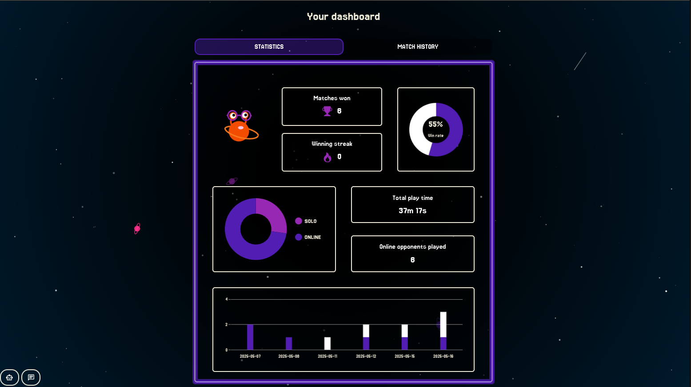

# Space Pong

A full-stack web application to organize and play online Pong games and tournaments.  
Built with Django (REST API) and vanilla JavaScript with Bootstrap.

## Features

- Pong games (solo vs IA, mumltiplayer local, multiplayer online)
- User authentication with 2FA (email or app)
- Join, create, and manage tournaments
- Personal dashboard with stats and match history
- Friends management
- Live chat

## Screenshots

